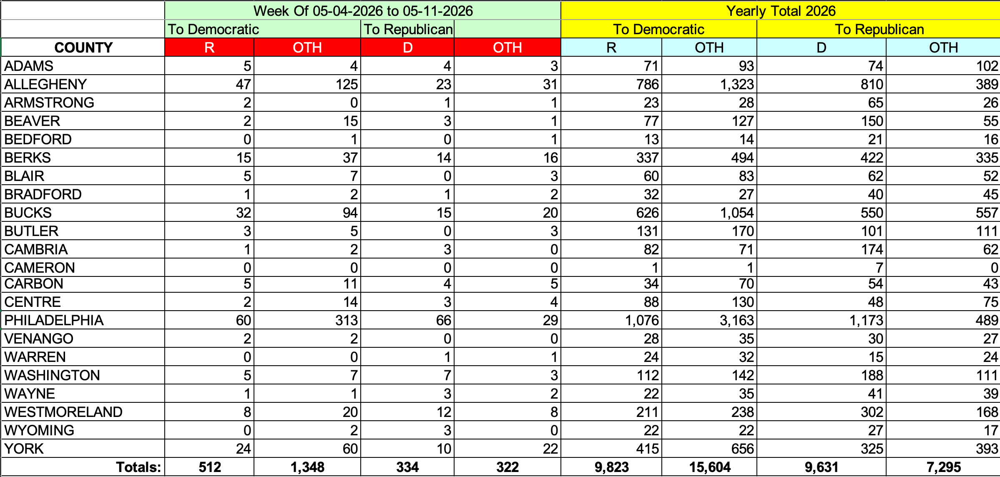

```{r}
#| echo: FALSE
#| message: FALSE
#| warning: FALSE
library(tidyverse)
```

::: {.callout-note style="font-size: 1.3em;"}
## [Today]{style="font-size: 1.3em;"}

**Before class**

- Read the syllabus (linked from Canvas).
- Read *Data Computing* §1.

**Plan for today**

- Course logistics
- Introduction to R and RStudio
- Tidy data
- R Demo

**Helpful links**

- [Syllabus](../../syllabus/syllabus.qmd) · [AI policy](../../syllabus/academic-integrity-and-ai-policy.qmd) · [Schedule](../../schedule.qmd) · [*Data Computing* §1](https://dtkaplan.github.io/DataComputingEbook/)
:::

## 1. Course Info & Introductions

**Summer Session 1: May 18, 2026 – June 26, 2026**

- **Class time:** M/T/W/Th/F, 9:35 a.m. to 10:50 a.m.

- **Class location:** Huck Life Sciences Building 007

- **Instructor:** Charles Costanzo 
  - Email: [cgc5478@psu.edu](mailto:cgc5478@psu.edu)
  - Office: Thomas 301 (Office Hours TBD)

- **Teaching Assistant (TA):** Xinyue Wang
  - Email: [xpw5228@psu.edu](mailto:xpw5228@psu.edu)


::: {.fragment .fade-in}
::: {.callout-tip style="font-size:1.4em"}
## Icebreaker: name, major, your favorite song right now.
:::
:::

## Learning Goals

This course will teach you how to:

::: {.fragment .fade-in}
- **Use R**: Program in the R *language* effectively and use the R *software environment* to efficiently compute with data.
:::

::: {.fragment .fade-in}
- **Wrangle Real Data**: Access, clean, join, and format data from various sources.
:::

::: {.fragment .fade-in}
- **Visualize Information**: Create graphical and descriptive summaries of data. 
:::

::: {.fragment .fade-in}
- **Build Reproducible Workflows**: Write well-documented code using tools like RStudio, RMarkdown, and Git/GitHub. 
:::

::: {.fragment .fade-in}
::: {.callout-tip style="font-size:1.4em"}
## No previous programming background is required for this course.
:::
:::

::: {.fragment .fade-in}
::: {.callout-important style="font-size:1.4em"}
## This is **not** a course on general purpose programming.
:::
:::

## Course logistics

- **Six weeks is short.** Daily pace is faster than a 15-week course. Falling a week---or even a day---behind is more serious than spring/fall courses.
- **Attendance matters.** Lots of in-class graded work (activities, quizzes, oral checkpoints).
- **Timely communication is critical.** Reach out to me **as soon as possible** if something comes up that necessitates you missing class, having a deadline extended, etc. 
- **Assignment Weights:**

  | Readings | Quizzes | In-class activities | Homework | Exam | Course project |
  | :---: | :---: | :---: | :---: | :---: | :---: |
  | 10% | 15% | 25% | 10% | 20% | 20% |

- **Grading Scheme:**

  | **A** | **A-** | **B+** | **B** | **B-** | **C+** | **C** | **D** | **F** |
  | :---: | :---: | :---: | :---: | :---: | :---: | :---: | :---: | :---: |
  | 93%+ | 90% | 87% | 83% | 80% | 77% | 70% | 60% | < 60% |


## AI policy

- AI is allowed on homework, take-home exam, project **with disclosure**. *Not* allowed on in-class work.
- Disclosure is graded on homework, but it is **not** an integrity issue if you skip it (you will just lose points.)
- Lying about AI use *is* an integrity issue.
- Oral project checkpoints are how I verify you understand your own work.
- Practical implication: AI is a study aid, not a substitute. The course is designed so that students who lean on it too heavily will struggle on the in-class portions.

::: {.fragment .fade-in}
::: {.callout-note icon=false style="font-size:1.4em"}
## Discussion Questions
- How have you used AI in past courses? 
- What are your initial thoughts on the policy?
:::
:::

## What is R?

R is a **programming language** *and* a **software environment** for statistical computing and graphics.

- Designed by statisticians for the purpose of data analysis.
- First version created in August 1993 (almost 33 years ago).
- Has grown rapidly in popularity and is widely used in academia and industry by statisticians, data analysts, and data scientists alike.
- Enormous number of user-contributed **packages**, which are add-ons that extend the functionality of R. 
  - Currently the Comprehensive R Archive Network (CRAN) package repository features 23,670 available packages.[^1] 

[^1]: [As of May 15, 2026.](https://cran.r-project.org/web/packages/)

## Some Examples of Said R Packages

::: {#fig-packages}
[{fig-align="center" width="100%"}](https://github.com/rstudio/hex-stickers)

Hex stickers from the [rstudio/hex-stickers](https://github.com/rstudio/hex-stickers) repository.
:::
## R vs. RStudio

  - **R** is a computer language that performs computations based on human-written instructions.
  - **RStudio** is an integrated development environment (**IDE**) for R programming. It combines the R console with supplementary tools for more efficient R programming. 

::: {#fig-r-rstudio layout="[30, 15, 70]"}

{#fig-r}

<div></div>

{#fig-rstudio}

R and RStudio logos.
:::

## Tidy Data $\neq$ Neat Data

::: {.callout-tip style="font-size:1.1em"}
## This table is easy for humans to read. What might make it tricky for a computer to read?
:::

{#fig-pa-voters-untidy fig-align="center" width="65%"}

::: {.fragment .fade-in}
**Two simple rules for Tidy Data:**
:::

::: {.fragment .fade-in}
  1. **Consistent Cases (Rows)**: Every row represents the same underlying attribute
  2. **Uniform Variables (Columns)**: Every column contains the same type of value.
:::

## PA Voter Table - Tidied Up {.scrollable}

::: {style="display: flex; justify-content: left;"}
```{r}
#| echo: TRUE
#| code-fold: true
#| code-summary: "Show the R code."

# 1. Load data and provide clean column names to handle the nested headers
raw_data <- readxl::read_excel("data/currentvotestats.xlsx", 
                       sheet = "Party-to-Party(2026)", 
                       skip = 3, # Skip the human-readable headers
                       col_names = c("county", 
                                     "week_dem_R", "week_dem_OTH", 
                                     "week_rep_D", "week_rep_OTH",
                                     "year_dem_R", "year_dem_OTH", 
                                     "year_rep_D", "year_rep_OTH"))

# 2. Clean and Pivot
tidy_voter_data <- raw_data %>%
  filter(!is.na(county), county != "Totals:") %>% # Rule 1: Consistent Cases
  pivot_longer(
    cols = -county, 
    names_to = c("period", "target_party", "origin_party"),
    names_sep = "_",
    values_to = "count"
  )

knitr::kable(head(tidy_voter_data %>% filter(county == "CENTRE")))
```
:::

## Demo: what R can do {.scrollable}

::: notes
Live demo — students just watch, no need to follow along.

Goals:
- Show R is a real programming environment, not a calculator.
- Walk through a complete small analysis: load, clean, visualize, summarize.
- Make it look easy.

Narrate at a high level — don't get into syntax, they'll learn that.

Candidate datasets:
- `palmerpenguins::penguins` — clean and visually striking (current pick)
- Tidy Tuesday "horror movies" or similar topical
- NYC airbnb pricing
:::

::: {style="display: flex; justify-content: left;"}
```{r}
#| eval: true
#| echo: true
#| code-fold: true
#| code-summary: "Show the R code."
library(tidyverse)
library(palmerpenguins)

# What does the data look like?
glimpse(penguins)

# Quick summary by species
penguins |>
  group_by(species) |>
  summarize(
    n            = n(),
    mean_mass_g  = mean(body_mass_g,    na.rm = TRUE),
    mean_bill_mm = mean(bill_length_mm, na.rm = TRUE)
  )

# A nice plot
penguins |>
  ggplot(aes(x = bill_length_mm, y = body_mass_g, color = species)) +
  geom_point(alpha = 0.7) +
  geom_smooth(method = "lm", se = FALSE) +
  labs(
    title = "Bill length vs body mass, by species",
    x = "Bill length (mm)",
    y = "Body mass (g)"
  ) +
  theme_minimal()
```
:::

## Setup checklist — due by Tuesday {.scrollable}

**Install R and RStudio**

- R: <https://cloud.r-project.org>
- RStudio: <https://posit.co/download/rstudio-desktop>

::: {.callout-warning}
## Mac users
Install [**XQuartz**](https://www.xquartz.org) too — some packages we'll use later in the course need it.
:::

**Configure RStudio**

- `Tools > Global Options... > General`
- Restore .RData into workspace at startup: **Unchecked**
- Save workspace to .RData on exit: **Never**

**Assignments due Tuesday**

- [HW 0: Setup confirmation](#) <!-- replace # with Canvas link -->
- [Reading Quiz 1](#) on *Data Computing* §2.1–2.3
- Read *Data Computing* §2.1–2.3 before class

## Wrap-up & looking ahead

**Tomorrow:** Real R syntax (variables, functions, vectors)

**Due Tuesday before class:**

- [HW 0: Setup confirmation](#)
- [Reading Quiz 1](#) on Canvas
- Read *Data Computing* §2.1–2.3

**Reference links**

- [Syllabus](../../syllabus/syllabus.qmd) · [AI policy](../../syllabus/academic-integrity-and-ai-policy.qmd) · [Schedule](../../schedule.qmd) · [*Data Computing*](https://dtkaplan.github.io/DataComputingEbook/)

::: {.callout-note icon=false}
## Reach out
Stuck on setup? Email me ([cgc5478@psu.edu](mailto:cgc5478@psu.edu)) or Xinyue ([xpw5228@psu.edu](mailto:xpw5228@psu.edu)) before Tuesday — don't wait until class.
:::

