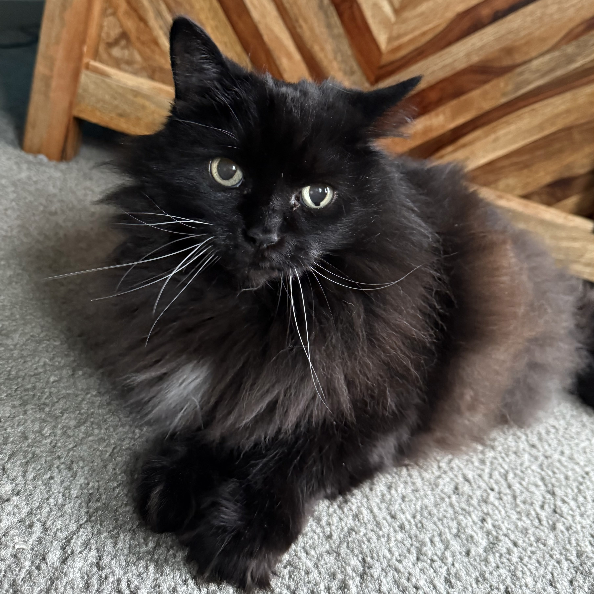
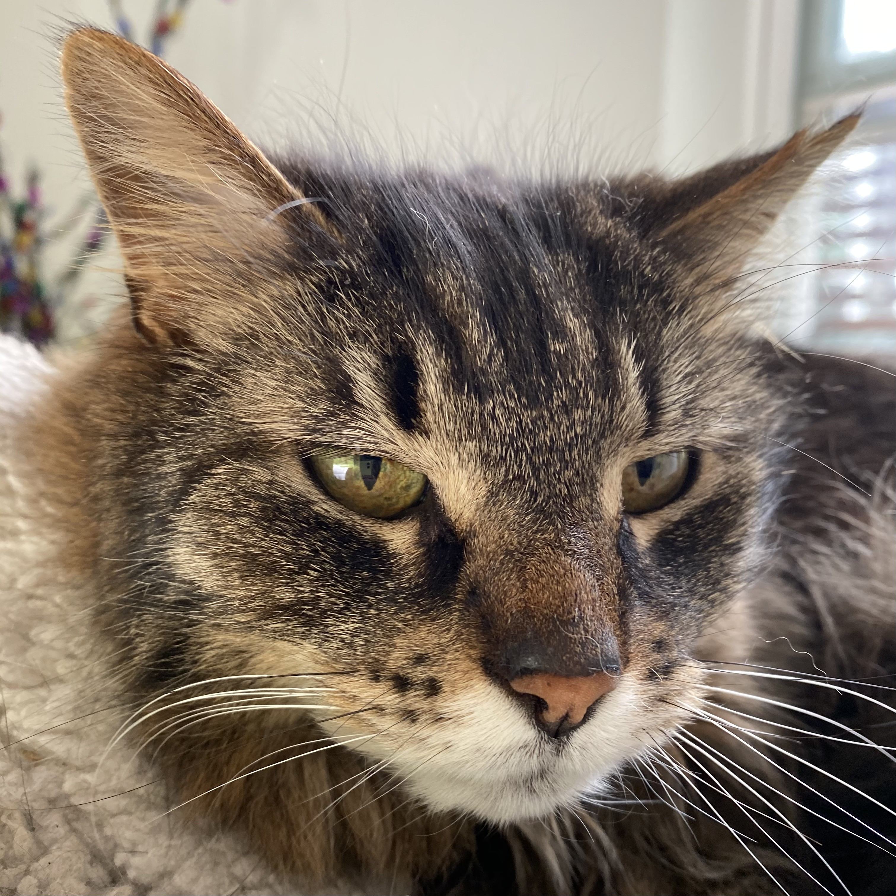
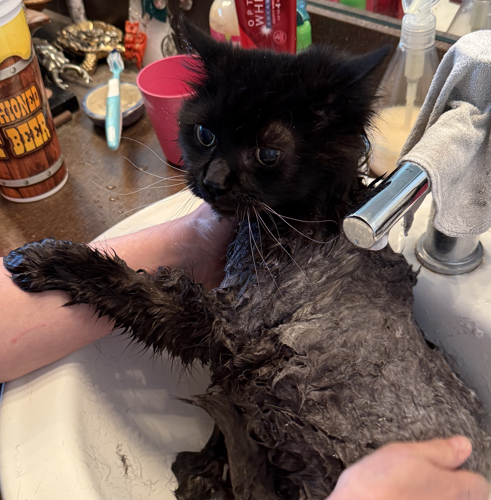
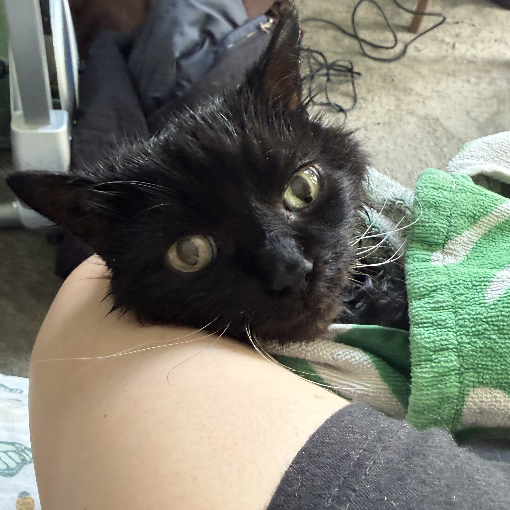
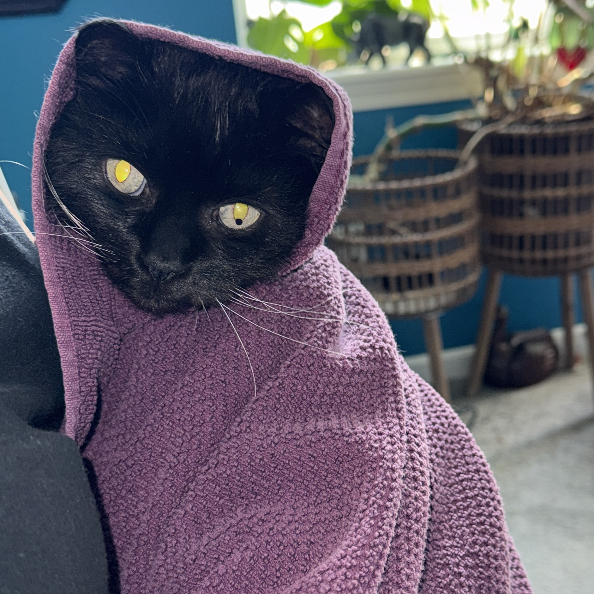

```{r}
#| echo: FALSE
#| message: FALSE
#| warning: FALSE
library(tidyverse)
```

## Introductions

**Instructor**: Charles Costanzo

- Statistics Ph.D. student
- Hometown: Solon, OH
- Some of my favorite things: cats, coffee, R (unironically)

## Solon, Ohio

```{r}
#| echo: TRUE
#| message: FALSE
#| warning: FALSE
#| code-fold: TRUE
#| code-summary: "Show the R code."
#| fig-align: center
#| fig-width: 8
#| fig-height: 8
#| out-width: 70%
#| fig-alt: "Map of Ohio with all counties outlined in light gray. Cuyahoga County in the northeast is shaded light blue, and within it the city of Solon is shaded dark blue with a labeled marker. The map highlights Solon's location in northeastern Ohio."

# Install these first if you don't have them:
# install.packages(c("sf", "tigris"))
library(ggplot2)
library(sf)
library(tigris)
library(dplyr)

options(tigris_use_cache = TRUE)

# Fetch spatial data
ohio_counties <- counties(state = "OH", cb = TRUE, progress_bar = FALSE)
ohio_places <- places(state = "OH", cb = TRUE, progress_bar = FALSE)

# Isolate areas
cuyahoga_county <- ohio_counties %>% filter(NAME == "Cuyahoga")
solon_city <- ohio_places %>% filter(NAME == "Solon")

# Build the map
ggplot() +
  geom_sf(data = ohio_counties,
          fill = "#f8f9fa", color = "grey", linewidth = 0.3) +
  geom_sf(data = cuyahoga_county,
          fill = "#D6EAF8", color = "#2980B9", linewidth = 0.5) +
  geom_sf(data = solon_city,
          fill = "dodgerblue", color = "darkblue", linewidth = 0.5) +
  geom_sf_text(data = solon_city, aes(label = NAME),
               size = 5, fontface = "bold", color = "dodgerblue",
               nudge_y = -0.05, nudge_x = 0.25) +
  theme_void()
```

## Meet My Cats!

::: {.content-visible unless-format="pdf"}
::: {layout-ncol=2}
{fig-alt="A fluffy black cat named Babuh sitting calmly and looking at the camera."}

{fig-alt="A brown tabby cat named Tartarus lounging contentedly."}
:::
:::

::: {.content-visible when-format="pdf"}
{width=45% fig-alt="A fluffy black cat named Babuh sitting calmly and looking at the camera."}
{width=45% fig-alt="A brown tabby cat named Tartarus lounging contentedly."}

*Babuh (left) and Tartarus (right).*
:::

## More Realistic Cat Photos...

::: {.content-visible unless-format="pdf"}
::: {layout-ncol=3}
{.fragment fig-alt="Babuh the gray cat in a bathtub, fur wet and flattened, looking distinctly unhappy."}

{.fragment fig-alt="Babuh the gray cat being lathered with shampoo during a bath, looking miserable."}

{.fragment fig-alt="Babuh the gray cat wrapped in a towel after the bath, fur damp and disheveled."}
:::
:::

::: {.content-visible when-format="pdf"}
{width=30% fig-alt="Babuh the gray cat in a bathtub, fur wet and flattened, looking distinctly unhappy."}
{width=30% fig-alt="Babuh the gray cat being lathered with shampoo during a bath, looking miserable."}
{width=30% fig-alt="Babuh the gray cat wrapped in a towel after the bath, fur damp and disheveled."}

*Babuh: soaked and indignant, mid-bath, then wrapped in a towel.*
:::

## Countries I've Been To

```{r}
#| echo: TRUE
#| message: FALSE
#| warning: FALSE
#| code-fold: TRUE
#| code-summary: "Show the R code."
#| fig-align: center
#| fig-width: 10
#| fig-height: 5
#| out-width: 90%
#| fig-alt: "World map with countries the instructor has visited shaded in coral orange and other countries in light gray. Visited countries are Canada, USA, Argentina, Uruguay, Switzerland, Rwanda, Spain, France, and Turkey, spanning North America, South America, Europe, and East Africa."

library(ggplot2)
library(maps)
library(dplyr)

world_map <- map_data("world")

visited_countries <- c("Canada", "USA", "Argentina", "Uruguay",
                       "Switzerland", "Rwanda", "Spain", "France", "Turkey")

world_map <- world_map %>%
  mutate(visited = ifelse(region %in% visited_countries, "Visited", "Not Visited"))

ggplot(world_map, aes(x = long, y = lat, group = group, fill = visited)) +
  geom_polygon(color = "white", linewidth = 0.2) +
  scale_fill_manual(values = c("Not Visited" = "#e0e0e0", "Visited" = "#FF7F50")) +
  theme_void() +
  theme(legend.position = "none")
```

## States I've Lived In & Visited

```{r}
#| echo: TRUE
#| message: FALSE
#| warning: FALSE
#| code-fold: TRUE
#| code-summary: "Show the R code."
#| fig-align: center
#| fig-width: 10
#| fig-height: 6
#| out-width: 90%
#| fig-alt: "Map of the continental United States with three categories. States lived in (Ohio, Pennsylvania, Texas) are shaded dark navy blue. States visited (many states across the West, Midwest, South, and Northeast plus DC) are shaded medium blue. Remaining states are light gray. Legend at the bottom labels Lived, Visited, and Not Visited."

# Note: install.packages("mapproj") if needed
library(ggplot2)
library(maps)
library(dplyr)
library(mapproj)

us_map <- map_data("state")

lived_in <- tolower(c("Ohio", "Pennsylvania", "Texas"))

# Note: "District of Columbia" matches the map data; "Washington DC" wouldn't
visited <- tolower(c("Washington", "Oregon", "California", "Nevada", "Idaho",
                     "Montana", "Arizona", "New Mexico", "Colorado", "Wyoming",
                     "North Dakota", "South Dakota", "Kansas", "Iowa",
                     "Nebraska", "Minnesota", "Wisconsin", "Michigan", "Indiana",
                     "Illinois", "Kentucky", "Tennessee", "Louisiana", "Florida",
                     "Georgia", "North Carolina", "South Carolina", "Virginia",
                     "District of Columbia", "Maryland", "Delaware", "New Jersey",
                     "New York", "Missouri", "Utah", "West Virginia"))

us_map <- us_map %>%
  mutate(status = case_when(
    region %in% lived_in ~ "Lived",
    region %in% visited ~ "Visited",
    TRUE ~ "Not Visited"
  )) %>%
  mutate(status = factor(status, levels = c("Lived", "Visited", "Not Visited")))

ggplot(us_map, aes(x = long, y = lat, group = group, fill = status)) +
  geom_polygon(color = "white", linewidth = 0.3) +
  scale_fill_manual(values = c("Lived" = "#2C3E50",
                               "Visited" = "#3498DB",
                               "Not Visited" = "#E0E0E0")) +
  coord_map("albers", lat0 = 39, lat1 = 45) +
  theme_void() +
  theme(legend.position = "bottom",
        legend.title = element_blank(),
        legend.text = element_text(size = 14))
```

## Icebreaker 🧊: Share Your...

- Name
- Major
- Programming Experience
- A Fun Fact (Favorite Song, Color, Food, etc.)

##

::: {.callout-note style="font-size: 1.3em;"}
## [Today: Monday May 18]{style="font-size: 1.3em;"}

**Before class**

- Read the syllabus ([Click here](../../syllabus/syllabus.qmd)).
- (Optional): Read *Data Computing* §1.1–1.5 ([Click here](https://psu.instructure.com/courses/2487468/assignments/18298036)).

**Plan for today**

- Course logistics
- Introduction to R and RStudio
- Tidy data
- R Demo

**Helpful links**

- [Syllabus](../../syllabus/syllabus.qmd) · [AI policy](../../syllabus/academic-integrity-and-ai-policy.qmd) · [Schedule](../../schedule.qmd) · [*Data Computing* §1](https://dtkaplan.github.io/DataComputingEbook/)
:::

# Course logistics {background-color="#001E44"}

## Course Info

**Summer Session 1: May 18, 2026 – June 26, 2026**

- **Class time:** M/T/W/Th/F, 9:35 a.m. to 10:50 a.m.

- **Class location:** Huck Life Sciences Building 007

- **Instructor:** Charles Costanzo
  - Email: [cgc5478@psu.edu](mailto:cgc5478@psu.edu)
  - Office Hours: M/W/Th/F: 10:50-11:50 a.m. in Huck 005 (or on Zoom by appt)

- **Teaching Assistant (TA):** Xinyue Wang
  - Email: [xpw5228@psu.edu](mailto:xpw5228@psu.edu)

## Learning Goals

This course will teach you how to:

::: {.fragment .fade-in}
- **Use R**: Program in the R *language* effectively and use the R *software environment* to efficiently compute with data.
:::

::: {.fragment .fade-in}
- **Wrangle Real Data**: Access, clean, join, and format data from various sources.
:::

::: {.fragment .fade-in}
- **Visualize Information**: Create graphical and descriptive summaries of data.
:::

::: {.fragment .fade-in}
- **Build Reproducible Workflows**: Write well-documented code using tools like RStudio, RMarkdown, and Git/GitHub.
:::

::: {.fragment .fade-in}
::: {.callout-tip style="font-size:1.4em"}
## No previous programming background is required for this course.
:::
:::

::: {.fragment .fade-in}
::: {.callout-important style="font-size:1.4em"}
## This is **not** a course on general purpose programming.
:::
:::

## Course logistics

- **Six weeks is short.** Daily pace is faster than a 15-week course. Falling a week---or even a day---behind is more serious than spring/fall courses.
- **Attendance matters.** Lots of in-class graded work (activities, quizzes, oral checkpoints).
- **Timely communication is critical.** Reach out to me **as soon as possible** if something comes up that necessitates you missing class, having a deadline extended, etc.

| Readings | Quizzes | In-class activities | Homework | Exam | Course project |
|:---:|:---:|:---:|:---:|:---:|:---:|
| 10% | 15% | 25% | 10% | 20% | 20% |

: **Assignment weights**

| A | A- | B+ | B | B- | C+ | C | D | F |
|:---:|:---:|:---:|:---:|:---:|:---:|:---:|:---:|:---:|
| 93% | 90% | 87% | 83% | 80% | 77% | 70% | 60% | below 60% |

: **Grading scheme**

## AI policy

- **Open assessments (Homework & Project):** AI tools are permitted **with mandatory disclosure**.
- **Closed-book, in-person work (Quizzes, Exam, Activities, Oral Checkpoints):** AI tools are **strictly prohibited**.
- **Disclosure is graded (1-2 points).**
- You must be able to explain any code you submit, which I will verify during in-class oral project checkpoints.
- Roughly 60% of your grade comes from verified in-person work where AI cannot be used.

## Course Readings (Perusall)

- All assigned textbook readings are hosted on **Perusall**, a collaborative e-reading platform.
- **How grading works:** You earn credit through holistic engagement (reading the entire text, spending active time, leaving high-quality comments, and replying to classmates).
- **No access code needed!** You must access readings *directly through Canvas links* to automatically authenticate your Penn State account.

::: {.fragment .fade-in}
::: {.callout-important style="font-size:1.3em"}
## Let's try it together right now:
1. Log into our Canvas course.
2. Click the "Perusall" tab on the left.
3. Click the link for **DC Section 1 (§1.1–1.5)**.
:::
:::

# What is R? {background-color="#001E44"}

## What is R?

R is a **programming language** *and* a **software environment** for statistical computing and graphics.

- Designed by statisticians for the purpose of data analysis.
- First version created in August 1993 (almost 33 years ago).
- Has grown rapidly in popularity and is widely used in academia and industry by statisticians, data analysts, and data scientists alike.
- Enormous number of user-contributed **packages**, which are add-ons that extend the functionality of R.
  - Currently the Comprehensive R Archive Network (CRAN) package repository features 23,664 available packages.[^1]

[^1]: [As of May 17, 2026.](https://cran.r-project.org/web/packages/)

## Some Examples of Said R Packages

::: {.content-visible unless-format="pdf"}
[{fig-align="center" width="100%" fig-alt="A grid of dozens of hexagonal stickers, each representing a different R package such as ggplot2, dplyr, tidyr, shiny, knitr, and others. The hex stickers are tiled together into a colorful honeycomb pattern."}](https://github.com/rstudio/hex-stickers)

Hex stickers from the [rstudio/hex-stickers](https://github.com/rstudio/hex-stickers) repository.
:::

::: {.content-visible when-format="pdf"}
{width=90% fig-alt="A grid of dozens of hexagonal stickers, each representing a different R package such as ggplot2, dplyr, tidyr, shiny, knitr, and others. The hex stickers are tiled together into a colorful honeycomb pattern."}

Hex stickers from the [rstudio/hex-stickers](https://github.com/rstudio/hex-stickers) repository.
:::

## R vs. RStudio

- **R** is a computer language that performs computations based on human-written instructions.
- **RStudio** is an integrated development environment (**IDE**) for R programming. It combines the R console with supplementary tools for more efficient R programming.

::: {.content-visible unless-format="pdf"}
::: {layout="[30, -10, 60]"}
{fig-alt="The R programming language logo: a stylized capital letter R in blue, set inside a gray oval ring."}

{fig-alt="The RStudio logo: the word RStudio in dark text next to a light blue hexagonal icon containing a stylized R."}
:::
:::

::: {.content-visible when-format="pdf"}
{width=20% fig-alt="The R programming language logo: a stylized capital letter R in blue, set inside a gray oval ring."}
{width=45% fig-alt="The RStudio logo: the word RStudio in dark text next to a light blue hexagonal icon containing a stylized R."}

*Left: **R** (don't open this). Right: **RStudio** (open this).*
:::

# Tidy data {background-color="#001E44"}

## Tidy Data $\neq$ Neat Data

::: {.callout-tip style="font-size:1.1em"}
## This table is easy for humans to read. What might make it tricky for a computer to read?
:::

{fig-align="center" width="65%" fig-alt="Screenshot of a Pennsylvania Department of State spreadsheet showing voter party-change applications by county. The layout uses multi-row merged header cells that group columns under 'This week' and 'Year to date', with sub-headers splitting each group into Democratic and Republican target parties, and further sub-headers for origin party (Republican or Other / Democratic or Other). County names run down the leftmost column. This nested-header structure is readable for humans but difficult for software to parse as a flat data table."}

::: {.fragment .fade-in}
**Two simple rules for Tidy Data:**
:::

::: {.fragment .fade-in}
  1. **Consistent Cases (Rows)**: Each row must represent a single, distinct instance of your unit of observation.
  2. **Uniform Variables (Columns)**: Every column contains the same type of value.
:::

## PA Voter Table - Tidied Up {.scrollable}

```{r}
#| echo: TRUE
#| code-fold: true
#| code-summary: "Show the R code."

# 1. Load data and provide clean column names to handle the nested headers
raw_data <- readxl::read_excel("data/currentvotestats.xlsx",
                       sheet = "Party-to-Party(2026)",
                       skip = 3, # Skip the human-readable headers
                       col_names = c("county",
                                     "week_dem_R", "week_dem_OTH",
                                     "week_rep_D", "week_rep_OTH",
                                     "year_dem_R", "year_dem_OTH",
                                     "year_rep_D", "year_rep_OTH"))

# 2. Clean and Pivot
tidy_voter_data <- raw_data %>%
  filter(!is.na(county), county != "Totals:") %>%
  pivot_longer(
    cols = -county,
    names_to = c("period", "target_party", "origin_party"),
    names_sep = "_",
    values_to = "count"
  )

knitr::kable(
  head(tidy_voter_data %>% filter(county == "CENTRE")),
  caption = "First six rows of the tidied PA voter party-change data, filtered to Centre County. Each row is one combination of period, target party, and origin party with its corresponding count."
)
```

# Demos {background-color="#001E44"}

## Demo: what R can do {.scrollable}

```{r}
#| eval: true
#| echo: true
#| code-fold: true
#| code-summary: "Show the R code."
#| fig-align: center
#| fig-width: 8
#| fig-height: 5
#| out-width: 90%
#| fig-alt: "Scatter plot of bill length in millimeters on the x-axis versus body mass in grams on the y-axis for three penguin species: Adelie, Chinstrap, and Gentoo. Each species is plotted in a different color with a linear best-fit line. Gentoo penguins cluster at the top right (longer bills, heavier bodies); Adelie penguins cluster at the bottom left (shorter bills, lighter bodies); Chinstrap penguins fall in between with longer bills but moderate body mass."

library(tidyverse)
library(palmerpenguins)

# What does the data look like?
glimpse(penguins)

# Quick summary by species
penguins |>
  group_by(species) |>
  summarize(
    n            = n(),
    mean_mass_g  = mean(body_mass_g,    na.rm = TRUE),
    mean_bill_mm = mean(bill_length_mm, na.rm = TRUE)
  )

# A nice plot
penguins |>
  ggplot(aes(x = bill_length_mm, y = body_mass_g, color = species)) +
  geom_point(alpha = 0.7) +
  geom_smooth(method = "lm", se = FALSE) +
  labs(
    title = "Bill length vs body mass, by species",
    x = "Bill length (mm)",
    y = "Body mass (g)"
  ) +
  theme_minimal()
```

## Demo: a campus map {.scrollable}

::: {.content-visible when-format="html"}
```{r}
#| eval: !expr knitr::is_html_output()
#| echo: true
#| code-fold: true
#| code-summary: "Show the interactive Leaflet code."
#| fig-alt: "Interactive satellite-imagery map of Centre County, Pennsylvania. The county boundary is outlined with a dashed white border and shaded faintly in dark blue. A bright blue dot marks the Huck Life Sciences Building on the Penn State University Park campus; hovering shows the building name and clicking reveals 'Class meets in Room 007.'"

library(tidyverse)
library(sf)
library(tigris)
library(leaflet)

# 1. Centre County boundary, reprojected for Leaflet (WGS84 / CRS 4326)
options(tigris_use_cache = TRUE)
centre_county <- counties(state = "PA", cb = TRUE, progress_bar = FALSE) |>
  filter(NAME == "Centre") |>
  st_transform(4326)

# 2. Huck Life Sciences Building
huck_building <- tibble(
  lon = -77.86146,
  lat = 40.80100,
  name = "Huck Life Sciences Building"
) |>
  st_as_sf(coords = c("lon", "lat"), crs = 4326)

# 3. Build the map
leaflet() |>
  addProviderTiles(providers$Esri.WorldImagery) |>
  addPolygons(
    data = centre_county,
    fillColor = "#041E42",
    fillOpacity = 0.1,
    color = "#FFF",
    weight = 3,
    dashArray = "5, 5"
  ) |>
  addCircleMarkers(
    data = huck_building,
    color = "#FFFFFF",
    weight = 1,
    fillColor = "#0096FF",
    radius = 8,
    fillOpacity = 0.9,
    label = ~name,
    labelOptions = labelOptions(
      style = list(
        "font-family" = "Arial, sans-serif",
        "font-weight" = "bold",
        "color" = "#041E42",
        "padding" = "4px 8px"
      ),
      direction = "auto"
    ),
    popup = "<b>Huck Life Sciences</b><br>Class meets in Room 007"
  )
```
:::

::: {.content-visible when-format="pdf"}
```{r}
#| eval: !expr knitr::is_latex_output()
#| echo: TRUE
#| warning: FALSE
#| message: FALSE
#| code-fold: TRUE
#| code-summary: "Show the static ggplot code."
#| fig-align: center
#| fig-width: 8
#| fig-height: 5
#| out-width: 90%
#| fig-alt: "Two-panel static map of Centre County, Pennsylvania, with a red dot marking the location of the Huck Life Sciences Building on the Penn State University Park campus. The main panel shows the county outline filled gray; the inset panel zooms into campus on an OpenStreetMap basemap with a labeled marker for Huck Life Sciences."

library(tidyverse)
library(sf)
library(tigris)
library(ggspatial)
library(patchwork)

options(tigris_use_cache = TRUE)
centre_county <- counties(state = "PA", cb = TRUE, progress_bar = FALSE) |>
  filter(NAME == "Centre")

huck_building <- tibble(
  lon = -77.86146,
  lat = 40.80100,
  name = "Huck Life Sciences"
) |>
  st_as_sf(coords = c("lon", "lat"), crs = 4326)

map_main <- ggplot() +
  geom_sf(data = centre_county, fill = "gray90", color = "gray50",
          linewidth = 0.5) +
  geom_sf(data = huck_building, color = "red", size = 3) +
  theme_void() +
  labs(title = "Centre County, Pennsylvania")

map_inset <- ggplot() +
  annotation_map_tile(type = "osm", zoom = 15, progress = "none") +
  geom_sf(data = huck_building, color = "red", size = 4) +
  geom_sf_label(data = huck_building, aes(label = name), nudge_y = 0.0015) +
  coord_sf(
    xlim = c(-77.870, -77.850),
    ylim = c(40.795, 40.805),
    expand = FALSE,
    crs = 4326
  ) +
  theme_void() +
  theme(panel.border = element_rect(color = "black", fill = NA,
                                    linewidth = 2))

map_main +
  inset_element(map_inset, left = 0.45, bottom = 0.05,
                right = 0.95, top = 0.45)
```
:::

## Setup checklist — due by Wednesday {.scrollable}

**Install R and RStudio**

- R: <https://cloud.r-project.org>
- RStudio: <https://posit.co/download/rstudio-desktop>

::: {.callout-warning}
## Mac users
Install [**XQuartz**](https://www.xquartz.org) too — some packages we'll use later in the course need it.
:::

**Configure RStudio**

- `Tools > Global Options... > General`
- Restore .RData into workspace at startup: **Unchecked**
- Save workspace to .RData on exit: **Never**

**Assignments due Wednesday 5/20**

- [HW 0: Setup confirmation](https://psu.instructure.com/courses/2487468/assignments/18308171)

## Wrap-up & looking ahead

**Tomorrow:** A tour of RStudio, R as a calculator, and creating your first objects

:::: {.columns}
::: {.column width="55%"}
**Upcoming Deadlines**

- **Tue 5/19, before class** — [DC §2.1–2.8](https://psu.instructure.com/courses/2487468/assignments/18307706)
- **Wed 5/20, 11:59 p.m.** — [HW 0: Setup](https://psu.instructure.com/courses/2487468/assignments/18308171)
- **Fri 5/22, in class** — Quiz 1
  - [Quiz 1 Practice](https://psu.instructure.com/courses/2487468/pages/quiz-1-practice?module_item_id=48166672)
- **Fri 5/22, 11:59 p.m.** — [HW 1: Basic R & Plots](https://psu.instructure.com/courses/2487468/assignments/18311694)
:::

::: {.column width="45%"}
**Reach out**

Stuck? Office hours, or email me ([cgc5478@psu.edu](mailto:cgc5478@psu.edu)) or Xinyue ([xpw5228@psu.edu](mailto:xpw5228@psu.edu)).

**Reference**

[Syllabus](../../syllabus/syllabus.qmd) · [AI policy](../../syllabus/academic-integrity-and-ai-policy.qmd) · [Schedule](../../schedule.qmd) · [*Data Computing*](https://dtkaplan.github.io/DataComputingEbook/)
:::
::::
