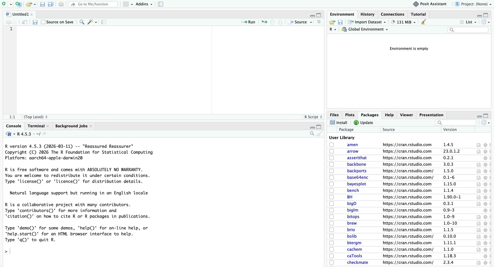
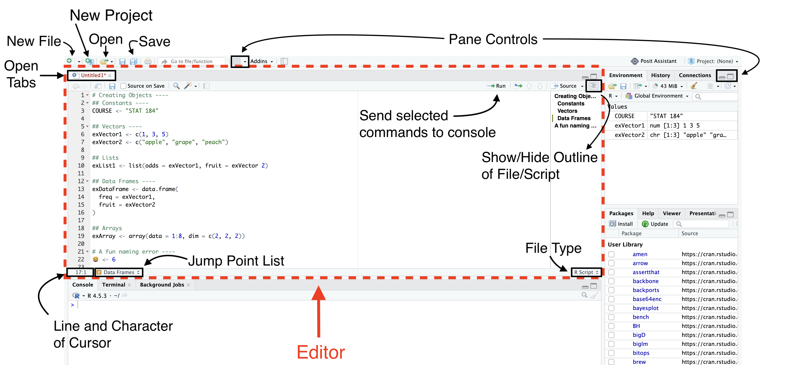
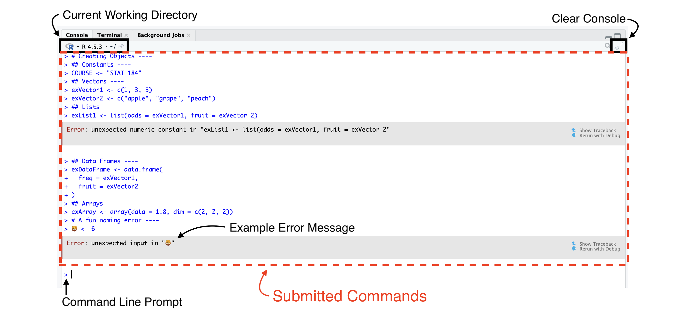
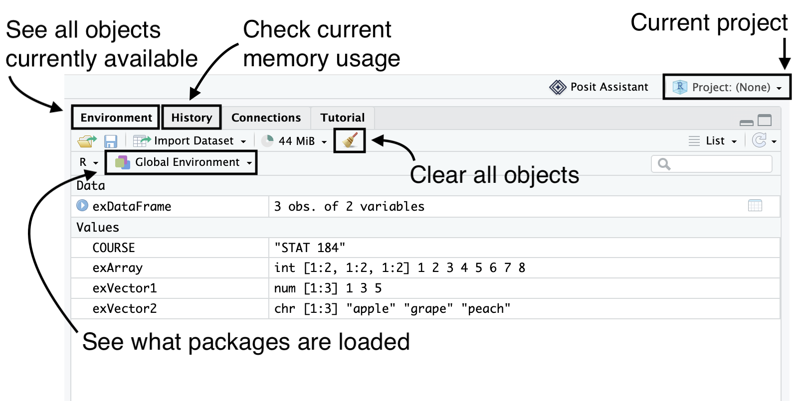
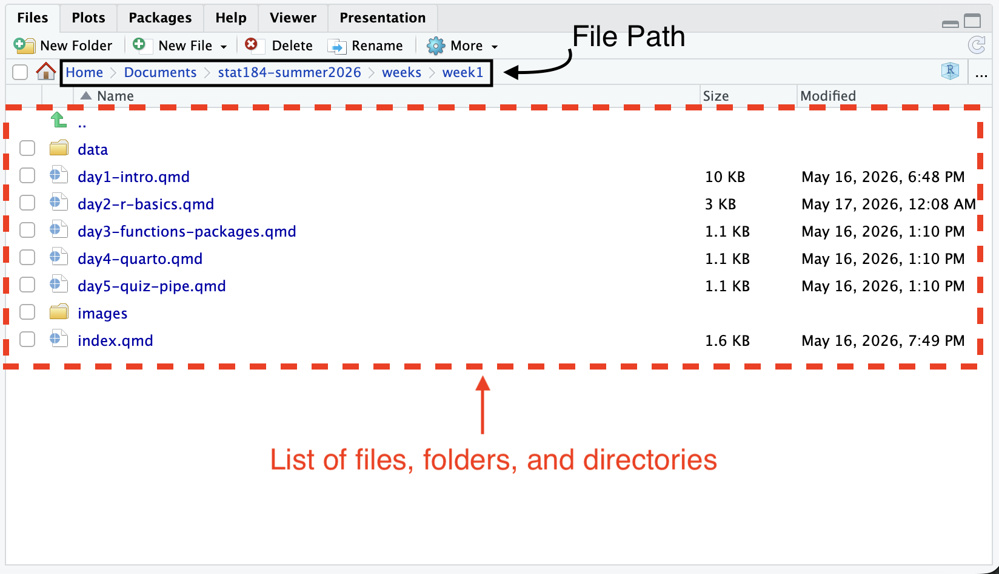
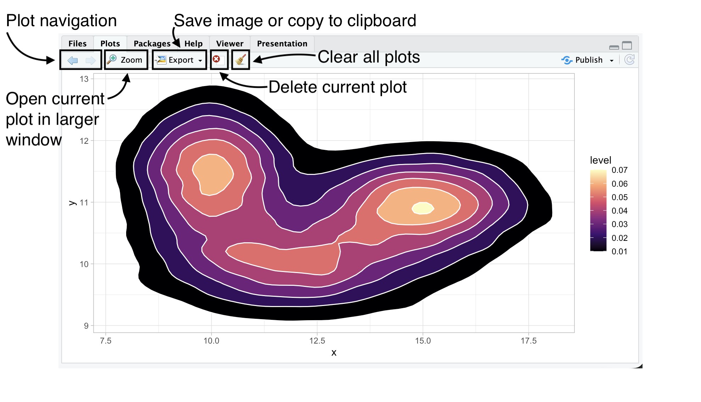
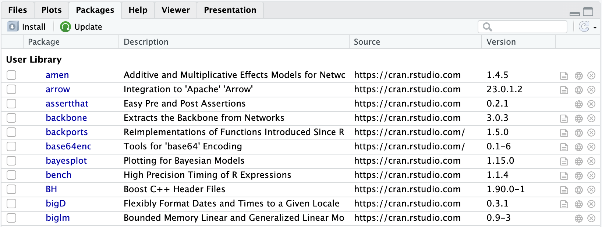
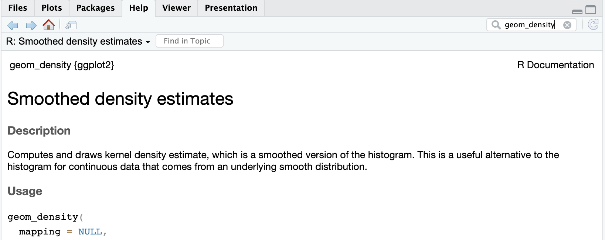

::: {.callout-note style="font-size: 1.3em;"}
## [Today: Tuesday May 19]{style="font-size: 1.3em;"}

**Before class**

- **First Perusall Assignment**: *Data Computing* §2.1-2.8 ([Click here](https://psu.instructure.com/courses/2487468/assignments/18307706)).

**Plan for today**

- Tour of RStudio
- Using R as a calculator
- Data types and vectors
- Creating objects

**Helpful links**

- [Syllabus](../../syllabus/syllabus.qmd) · [AI policy](../../syllabus/academic-integrity-and-ai-policy.qmd) · [Schedule](../../schedule.qmd) · [*Data Computing* §2](https://dtkaplan.github.io/DataComputingEbook/chap-computing-with-r.html#chap:computing-with-r)
:::

## What is Computing?

Computing is about turning human ideas into reproducible instructions that a computer can carry out.

In this course, we will learn how to:

- organize data
- automate calculations
- visualize information
- build reproducible analyses
- communicate results

R is the tool we will use to do that.

## Another Introduction to R

- R is a programming language designed for data analysis, statistics, and visualization.
- We use R to tell the computer exactly what computations we want to perform.
- R is widely used in:
  - statistics
  - data science
  - research
  - industry analytics
- R is free, open-source, and highly extensible through thousands of packages that contain additional tools and functions.

## RStudio Desktop (RStudio)

- First version released in 2011.
- *Integrated development environment (IDE)* provides additional tools and window management to R to help coders, statisticians, and data scientists use R more effectively.
- While R is required to run RStudio, you do not need to have RStudio to use R.

## R vs. RStudio

- **R** is the programming language.
- **RStudio** is the environment/interface we use to work with R more comfortably.

## RStudio's Four Pane Layout

{fig-align="center" width="100%" fig-alt="Screenshot of a freshly opened RStudio window divided into four quadrants. Top-left holds an empty script tab named Untitled1 with an editor toolbar that includes a Run button and a Source button. Bottom-left is the Console tab running R version 4.5.3 ('Reassured Reassurer') with the standard R startup message and a prompt symbol ready for input. Top-right shows the Environment pane labeled 'Environment is empty,' with tabs for History, Connections, and Tutorial. Bottom-right shows the Packages tab listing the installed user library (amen, arrow, assertthat, backbone, and so on) with checkboxes, source URLs, and version numbers."}

## Source Pane

{fig-align="center" width="100%" fig-alt="Annotated screenshot of the full RStudio window with the source (editor) pane outlined by a red dashed border and labeled 'Editor.' Hand-drawn arrows and callouts identify, clockwise from the top-left: 'New File,' 'New Project,' 'Open,' and 'Save' buttons on the main toolbar; 'Pane Controls' for layout adjustment; 'Open Tabs' showing the file tab labeled Untitled1; 'Send selected commands to console' pointing at the Run button; 'Show/Hide Outline of File/Script' pointing at the document outline; 'File Type' indicator showing 'R Script' at the bottom-right of the editor; 'Jump Point List' pointing to a section navigator showing 'Data Frames'; and 'Line and Character of Cursor' showing position 17:1. The example script contains code creating constants, vectors, lists, a data frame, and an array, plus a deliberately fun naming error where an emoji is assigned a value."}

## Console Pane

{fig-align="center" width="100%" fig-alt="Annotated screenshot of RStudio's console pane outlined in a red dashed border. Callouts identify: 'Current Working Directory' pointing to the R 4.5.3 version indicator and tilde-slash path at the top; 'Clear Console' pointing to the small broom icon at the top right; 'Submitted Commands' pointing to the body of the pane, which shows previously executed R commands prefixed with the prompt symbol; 'Example Error Message' pointing to a highlighted error reading 'Error: unexpected input' from a line that tried to assign a value to an emoji; and 'Command Line Prompt' pointing to the active prompt at the bottom waiting for new input. Two error blocks are visible mid-pane, each with 'Show Traceback' and 'Rerun with Debug' links on the right."}

## Environment Pane

{fig-align="center" width="100%" fig-alt="Annotated screenshot of RStudio's environment pane. Callouts identify: 'See all objects currently available' pointing to the Environment tab; 'Check current memory usage' pointing to the memory indicator showing 44 MiB; 'Current project' pointing to the project selector showing 'Project: (None)' in the top-right; 'Clear all objects' pointing to the broom icon; and 'See what packages are loaded' pointing to the language and environment selector showing 'R' and 'Global Environment.' The pane lists one data object (exDataFrame, 3 obs. of 2 variables) and four values: COURSE equal to 'STAT 184'; exArray as an integer array with dimensions 1:2 by 1:2 by 1:2 containing 1 through 8; exVector1 as num [1:3] 1 3 5; and exVector2 as chr [1:3] 'apple' 'grape' 'peach'."}

## Output Pane - Files Tab

{fig-align="center" width="80%" fig-alt="Annotated screenshot of RStudio's output pane with the Files tab selected. A callout labeled 'File Path' points to the breadcrumb navigation showing Home, Documents, stat184-summer2026, weeks, week1. A second callout labeled 'List of files, folders, and directories' (outlined with a red dashed border) points to the main file listing, which shows a parent-directory link, a 'data' folder, five Quarto files (day1-intro.qmd, day2-r-basics.qmd, day3-functions-packages.qmd, day4-quarto.qmd, day5-quiz-pipe.qmd), an 'images' folder, and index.qmd, along with their sizes and last-modified dates. The toolbar at the top has buttons for New Folder, New File, Delete, Rename, and More."}

## Output Pane - Plots Tab {.scrollable}

{fig-align="center" width="80%" fig-alt="Annotated screenshot of RStudio's output pane with the Plots tab selected, displaying a 2D filled density contour plot. Callouts identify: 'Plot navigation' pointing to the left and right arrow buttons for cycling through previous plots; 'Open current plot in larger window' pointing to the Zoom button; 'Save image or copy to clipboard' pointing to the Export button; 'Delete current plot' pointing to a small red X icon; and 'Clear all plots' pointing to the broom icon. The plot itself shows two adjacent dense regions in a magma color scale (deep black at low density, through purple and red to pale yellow at the peaks). The x-axis runs from about 7.5 to 17.5, the y-axis from 9 to 13, and a legend on the right labels the density 'level' from 0.01 (black) to 0.07 (pale yellow)."}

Darker regions indicate higher concentrations of observations; lighter regions represent lower densities. The plot combines filled density polygons with contour boundaries to visualize the distribution of simulated data.

```{r}
#| echo: TRUE
#| code-fold: true
#| code-summary: "Show the R code."
#| eval: FALSE

# Set Seed
set.seed(184)

# Library
library(tidyverse)

# Data
a <- data.frame(x = rnorm(20000, 12,   2),   y = rnorm(20000, 10,   0.5))
b <- data.frame(x = rnorm(20000, 15,   1.5), y = rnorm(20000, 11,   0.5))
c <- data.frame(x = rnorm(20000, 10,   1.1), y = rnorm(20000, 11.5, 0.7))
data <- rbind(a, b, c)

# Area + contour
ggplot(data, aes(x = x, y = y)) +
  stat_density_2d(aes(fill = after_stat(level)),
                  geom = "polygon", colour = "white") +
  theme_light() +
  scale_fill_viridis_c(option = "magma")
```

## Output Pane - Packages Tab

{fig-align="center" width="80%" fig-alt="Screenshot of RStudio's output pane with the Packages tab selected. The pane lists installed R packages from the User Library in a table with four columns: a checkbox indicating whether each package is loaded into the current session, the package name (shown in blue), a short description, the source URL (https://cran.rstudio.com), and the installed version number. Visible packages include amen ('Additive and Multiplicative Effects Models for Networks,' version 1.4.5), arrow ('Integration to Apache Arrow,' 23.0.1.2), assertthat ('Easy Pre and Post Assertions,' 0.2.1), backbone, backports, base64enc, bayesplot, bench, BH, bigD, and biglm. A toolbar at the top has Install and Update buttons and a search box."}

- The "Packages" tab will list all packages that you have currently installed on your machine. You can load a package by clicking the box to the left of the name.
- You can also use the "Install" and "Update" buttons to help you get new packages and keep them current.

## Output Pane - Help Tab

{fig-align="center" width="75%" fig-alt="Screenshot of RStudio's output pane with the Help tab selected. The search box in the top right contains the query 'geom_density.' The pane shows the help page for geom_density from the ggplot2 package, with the topic title 'Smoothed density estimates,' a navigation bar reading 'R: Smoothed density estimates' and 'Find in Topic,' a label 'R Documentation' on the right, and the start of the Description section: 'Computes and draws kernel density estimate, which is a smoothed version of the histogram. This is a useful alternative to the histogram for continuous data that comes from an underlying smooth distribution.' The beginning of the Usage section is visible below, showing the function signature 'geom_density(mapping = NULL,'."}

- The "Help" tab displays help documentation that has been included with the packages for functions, data sets, and other objects.
- **Help Shortcuts:** `?barplot`, `help(barplot)`, or `??barplot` (broad sweep). You can also place your cursor in the object name and press fn + F1 (or just F1 if your function keys are active).

## Data Types

- Data type refers to the nature of how we choose to record some value.
- **Common Data Types in R:**
  - Numeric (Double)
  - Integer
  - Complex
  - Character
  - Logical

## Data Structures {.scrollable}

- Data structures are the most important type of base objects in R as they will form the basis for all manipulations we do.
- R's data structures may be organized along two aspects:
  1. How many dimensions we need for values.
  2. If all values have to be the same data type.

| Structure  | Dimensions   | Mixed types?         |
|------------|--------------|----------------------|
| Vector     | 1            | No                   |
| List       | 1            | Yes                  |
| Matrix     | 2            | No                   |
| Data frame | 2            | Yes (across columns) |
| Array      | n ($\geq$ 2) | No                   |

: Summary of R's main base data structures by dimension and type-mixing. {#tbl-data-structures tbl-colwidths="[30,30,40]"}

## Data Structures Examples {.scrollable}

+------------------+-------------------------------+-------------------------------+
| Dimensions       | All Values Same Data Type     | A Mix of Data Types           |
+==================+===============================+===============================+
| **1 Dimension**  | **Atomic Vectors**            | **List**                      |
|                  |                               |                               |
|                  |     [1] 1 3 5                 |     [[1]]                     |
|                  |     [1] "apple" "grape"       |     [1] 1 3 5                 |
|                  |     "peach"                   |                               |
|                  |                               |     [[2]]                     |
|                  |                               |     [1] "apple" "grape"       |
|                  |                               |     "peach"                   |
+------------------+-------------------------------+-------------------------------+
| **2 Dimensions** | **Matrix**                    | **Data Frame**                |
|                  |                               |                               |
|                  |          [,1] [,2]            |       id  fruit               |
|                  |     [1,]    1    5            |     1  1  apple               |
|                  |     [2,]    3    7            |     2  3  grape               |
|                  |                               |     3  5  peach               |
+------------------+-------------------------------+-------------------------------+
| **n Dimensions** | **Array**                     | *Not applicable*              |
|                  |                               |                               |
|                  |     , , 1                     |                               |
|                  |                               |                               |
|                  |          [,1] [,2]            |                               |
|                  |     [1,]    1    5            |                               |
|                  |     [2,]    3    7            |                               |
|                  |                               |                               |
|                  |     , , 2                     |                               |
|                  |                               |                               |
|                  |          [,1] [,2]            |                               |
|                  |     [1,]    2    6            |                               |
|                  |     [2,]    4    8            |                               |
+------------------+-------------------------------+-------------------------------+

: Examples of each data structure showing its printed form in the R console. {#tbl-data-structures-ex}

## Data Structures Visualization {.scrollable}

```{r}
#| label: fig-data-structures
#| echo: TRUE
#| code-fold: true
#| code-summary: "Show the R code."
#| fig-width: 9
#| fig-height: 4
#| out-width: 90%
#| fig-align: center
#| fig-cap: "R's data structures as cubes: a vector (1D), matrix (2D), and array (3D)."
#| fig-alt: "Three isometric illustrations side by side labeled Vector, Matrix, and Array, showing how R's data structures grow in dimension. The vector is a single row of three cubes. The matrix is a 3-by-3 grid of cubes. The array is a 3-by-3-by-3 stack of cubes. Cubes alternate between light and slightly darker blue in a checkerboard pattern."

# Color palette
bg_color    <- "#FFFFFF"
light_blue  <- "#DDEAF5"
mid_blue    <- "#9BB8DC"
edge_color  <- "#001E44"   # Penn State Navy

# Draw a single unit cube at grid position (gx, gy, gz)
# Uses simple axonometric projection: x' = gx + 0.4*gz, y' = gy + 0.4*gz
draw_cube <- function(gx, gy, gz, fill = light_blue) {
  s  <- 1
  dx <- 0.4 * s
  dy <- 0.4 * s

  px <- gx + dx * gz
  py <- gy + dy * gz

  # Front face
  polygon(c(px, px + s, px + s, px),
          c(py, py,     py + s, py + s),
          col = fill, border = edge_color, lwd = 1.2)
  # Top face
  polygon(c(px,        px + s,        px + s + dx, px + dx),
          c(py + s,    py + s,        py + s + dy, py + s + dy),
          col = fill, border = edge_color, lwd = 1.2)
  # Right face (slightly darker for shading)
  shade <- adjustcolor(fill, red.f = 0.92, green.f = 0.92, blue.f = 0.95)
  polygon(c(px + s,    px + s + dx,   px + s + dx, px + s),
          c(py,        py + dy,       py + s + dy, py + s),
          col = shade, border = edge_color, lwd = 1.2)
}

# Alternating fill in 3D (checkerboard)
checker_fill <- function(i, j, k = 0) {
  if ((i + j + k) %% 2 == 0) light_blue else mid_blue
}

par(mar = c(0, 0, 0, 0), bg = bg_color)
plot.new()
plot.window(xlim = c(0, 18), ylim = c(0, 6), asp = 1)

# 1. Vector: 1 x 3 row
ox <- 1; oy <- 2.2
for (i in 0:2) {
  draw_cube(ox + i, oy, 0, fill = checker_fill(i, 0))
}
text(ox + 1.7, oy - 1, "Vector",
     cex = 1.4, col = edge_color, font = 2)

# 2. Matrix: 3 x 3 grid
ox <- 7; oy <- 1
for (j in 0:2) {
  for (i in 0:2) {
    draw_cube(ox + i, oy + j, 0, fill = checker_fill(i, j))
  }
}
text(ox + 1.7, oy - 1, "Matrix",
     cex = 1.4, col = edge_color, font = 2)

# 3. Array: 3 x 3 x 3 cube — draw back-to-front, bottom-up, left-right
ox <- 13; oy <- 1
for (k in 2:0) {
  for (j in 0:2) {
    for (i in 0:2) {
      draw_cube(ox + i, oy + j, k, fill = checker_fill(i, j, k))
    }
  }
}
text(ox + 2.3, oy - 1, "Array",
     cex = 1.4, col = edge_color, font = 2)
```

## R as a Calculator

You can use R as a calculator:

```{r}
#| echo: TRUE
184.101 * 9.35

(8 + 4) / 9

sqrt(8)

cos(2 * pi)
```

## Your Turn to Use the Calculator

Your turn. Open the console and try each line below; don't just read them, **type them**.

```{r}
#| echo: TRUE
#| results: "hide"
2 + 2

sqrt(16)

c(1, 2, 3) * 2

10 %% 3

x <- log(10^2, base = 10)
x
```

## Vector Operations

```{r}
#| echo: TRUE
c(1, 8, 4) + c(9, 3, 5)

c(1, 8, 4) * c(9, 3, 5)
```

- The `c()` function **concatenates** multiple individual values into one single vector.

## Built-in Functions and Constants

```{r}
#| echo: TRUE
exp(1)
sqrt(pi)
dnorm(0)
```

- `sqrt` computes the square root.
- `exp` computes the function $e^x$.
- `pi` is the constant $\pi$.
- `dnorm` computes the standard normal density function.

## Creating objects

You can create new objects with the **assignment operator**, `<-`:

```{r}
#| eval: FALSE
#| echo: TRUE
x <- 3 * 5
```

The above is an example of an **assignment statement**. In general, assignment statements have the form:

``` r
object_name <- value
```

In English, this is "object_name **gets** value."

- Even though typing `<-` for the many assignments you will make can be tedious, **don't use `=`**; it will work, but will cause confusion later.
- You can use the RStudio keyboard shortcut `Alt` + `-` (or `Option` + `-` on a Mac).
- Object names must start with a letter, and can only contain letters, numbers, `_`, and `.`

## Setup checklist — due by Wednesday {.scrollable}

**Install R and RStudio**

- R: <https://cloud.r-project.org>
- RStudio: <https://posit.co/download/rstudio-desktop>

::: {.callout-warning}
## Mac users
Install [**XQuartz**](https://www.xquartz.org) too — some packages we'll use later in the course need it.
:::

**Configure RStudio**

- `Tools > Global Options... > General`
- Restore .RData into workspace at startup: **Unchecked**
- Save workspace to .RData on exit: **Never**

## Wrap-up & looking ahead

**Tomorrow:** Functions, packages, the tidyverse, and objects.

:::: {.columns}
::: {.column width="55%"}
**Upcoming Deadlines**

- **Wed 5/20, before class** — [DC §3.1–3.5](https://psu.instructure.com/courses/2487468/assignments/18307709)
- **Wed 5/20, 11:59 p.m.** — [HW 0: Setup](https://psu.instructure.com/courses/2487468/assignments/18308171)
- **Fri 5/22, in class** — Quiz 1
- **Fri 5/22, 11:59 p.m.** — [HW 1: Basic R & Plots](https://psu.instructure.com/courses/2487468/assignments/18311694)
:::

::: {.column width="45%"}
**Reach out**

Stuck? Office hours, or email me ([cgc5478@psu.edu](mailto:cgc5478@psu.edu)) or Xinyue ([xpw5228@psu.edu](mailto:xpw5228@psu.edu)).

**Reference**

[Syllabus](../../syllabus/syllabus.qmd) · [AI policy](../../syllabus/academic-integrity-and-ai-policy.qmd) · [Schedule](../../schedule.qmd) · [*Data Computing*](https://dtkaplan.github.io/DataComputingEbook/)
:::
::::

