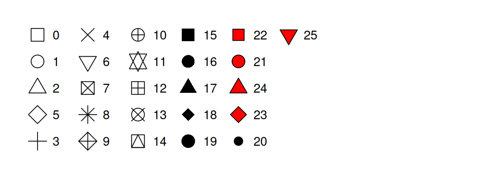

```{r}
#| echo: FALSE
#| message: FALSE
#| warning: FALSE
library(tidyverse)
```

::: {.callout-note style="font-size: 1.3em;"}
## [Today: Wednesday May 27]{style="font-size: 1.3em;"}

**Before class**

- **Perusall Assignment**: [DC §6.1–6.5](https://psu.instructure.com/courses/2487468/assignments/18317724)

**Plan for today**

- The grammar of graphics: a vocabulary for *any* plot
- Aesthetic mappings vs. fixed properties (and a common bug)
- Geoms in depth: layering, local vs. global, multiple data
- Statistical transformations: where do bar heights come from?
- Position adjustments: stacking, dodging, jittering
- In-class activity

**Helpful links**

- [Syllabus](../../syllabus/syllabus.qmd) · [AI policy](../../syllabus/academic-integrity-and-ai-policy.qmd) · [Schedule](../../schedule.qmd) · [*R4DS* Ch. 9](https://r4ds.hadley.nz/layers) · [DC §6](https://dtkaplan.github.io/DataComputingEbook/chap-frames-glyphs.html#chap:frames-glyphs) · [ggplot2 reference](https://ggplot2.tidyverse.org/reference)
:::

## Quick recap

We've been making ggplots for a while now. You know how to:

- Pass `data` and `aes()` to `ggplot()`
- Add a geom like `geom_point()`, `geom_bar()`, `geom_histogram()`
- Map variables to `x`, `y`, `color`, `fill`

Today we're going to **slow down** and look at what's actually happening under the hood.

::: {.fragment .fade-in}
::: {.callout-tip style="font-size: 1.1em;"}
The goal of today is to give you the tools to be able to build any plot you can describe.
:::
:::

# The grammar of graphics {background-color="#001E44"}

## A vocabulary for plots

The DC chapter introduces five words. These will come up a lot.

| Term | What it is |
|---|---|
| **frame** | The relationship between *position* and *data*. The coordinate system + the variables on each axis. |
| **glyph** | The basic graphical unit. One glyph = one case in your data frame. |
| **aesthetic** | Any graphical attribute of a glyph: position, size, color, shape, transparency, ... |
| **scale** | The rule that translates a *variable value* into an *aesthetic value*. |
| **guide** | What helps the viewer translate back: axes, tick marks, legends, color bars. |

: Five words to describe any data graphic. {tbl-colwidths="[20,80]"}

## One sentence, five words

::: {.callout-tip style="font-size: 1.15em;"}
A graphic is a collection of **glyphs** sitting inside a **frame**, where each glyph's **aesthetics** are controlled by **scales** that map variables to graphical attributes, and **guides** help the viewer read the scales backward.
:::

Today we focus on the first three; tomorrow we'll deal more with scales and guides.

## Why this matters

Once you have the vocabulary, debugging gets easier:

- "My color isn't working" $\rightarrow$ is it a *mapping* (inside `aes()`) or a *fixed property* (outside)?
- "I want different lines per group" $\rightarrow$ I need a discrete variable mapped to an aesthetic that *splits* the geom (color, linetype, group).
- "My bar chart shows counts but I want proportions" $\rightarrow$ I need to override the **stat**.

Every confusion you've had with ggplot maps onto one of these concepts.

# A dataset for today {background-color="#001E44"}

## The `storms` dataset

Built into the tidyverse (via `dplyr`). Records of every named Atlantic storm since 1975, drawn from NOAA's HURDAT2 reanalysis.

```{r}
#| echo: TRUE
storms
```

## Variables we'll use

| Variable | Description |
|---|---|
| `name`, `year`, `month`, `day`, `hour` | When the observation was taken |
| `lat`, `long` | Where the storm was |
| `status` | `tropical depression`, `tropical storm`, `hurricane`, ... |
| `category` | Saffir-Simpson scale (1–5), `NA` for non-hurricanes |
| `wind` | Maximum sustained wind speed, knots |
| `pressure` | Central pressure, millibars (lower = stronger) |

: Selected variables in `storms`. {tbl-colwidths="[35,65]"}

Each row is a **6-hour observation** of one storm, so single hurricane shows up many times as it moves and intensifies.

# Aesthetic mappings {background-color="#001E44"}

## Mapping vs. setting

The single most common ggplot bug is confusing **mapping** with **setting**.

::: {.columns}
::: {.column width="50%"}
**Mapping**: a variable controls the aesthetic.

Goes **inside** `aes()`.

```r
ggplot(storms, 
       aes(x = wind, y = pressure,
           color = status)) +
  geom_point()
```

`color` varies by `status` value.
:::

::: {.column width="50%"}
**Setting**: you fix the aesthetic to a constant.

Goes **outside** `aes()`.

```r
ggplot(storms, 
       aes(x = wind, y = pressure)) +
  geom_point(color = "steelblue")
```

Every point is steelblue.
:::
:::

## The classic mistake {.scrollable}

What does this do?

```{r}
#| eval: FALSE
#| echo: TRUE
ggplot(storms, aes(x = wind, y = pressure)) +
  geom_point(aes(color = "steelblue"))
```

::: {.fragment .fade-in}

```{r}
#| eval: TRUE
#| echo: FALSE
ggplot(storms, aes(x = wind, y = pressure)) +
  geom_point(aes(color = "steelblue"))
```

It makes every point a **salmon red** and adds a legend that says `"steelblue"`.

Why? `aes()` says "map a variable to color." We gave it the string `"steelblue"`, which ggplot treated as a one-level categorical variable. It then picked a default color (red-pink) for that one level.

**Rule of thumb:** if you want a constant color, it goes *outside* `aes()`. If you want it to depend on data, it goes *inside* `aes()`.
:::

## What can you map?

Every geom accepts a subset of these aesthetics. The most common:

| Aesthetic | Works on | Notes |
|---|---|---|
| `x`, `y` | almost everything | position in the frame |
| `color` | points, lines, borders | outline of a glyph |
| `fill` | bars, areas, filled shapes | interior of a glyph |
| `size` | points, lines | numerical only, ideally |
| `alpha` | almost everything | transparency, 0–1 |
| `shape` | points | max 6 discrete values by default |
| `linetype` | lines | solid, dashed, dotted, ... |
| `group` | grouped geoms | splits w/o adding a legend |

: Common aesthetics. {tbl-colwidths="[15,40,45]"}

## Discrete vs. continuous aesthetics

ggplot picks a scale automatically based on the **type** of the variable.

| Aesthetic | Discrete variable | Continuous variable |
|---|---|---|
| `color` / `fill` | qualitative palette (distinct hues) | gradient (e.g., light $\rightarrow$ dark) |
| `size` | warns — order is implied but levels aren't ordered | smooth size range |
| `shape` | distinct shapes (max 6) | error — shapes don't have an order |
| `alpha` | warns, same reason as size | smooth |

: How ggplot scales aesthetics by variable type. {tbl-colwidths="[20,40,40]"}

::: {.callout-warning}
Mapping a categorical variable like `status` to `size` or `alpha` tells the reader "these categories are ordered", which is often not actually the case. Stick to color, fill, shape, or facets for categorical splits.
:::

## Shape reference

In `ggplot`, you specify the shape of a point as a number.

::: {#fig-shapes-reference}



R has 26 built-in shapes that are identified by numbers. 

:::

## Example: status mapped four ways {.scrollable}

```{r}
#| echo: TRUE
#| eval: TRUE
# Color — good for categorical
ggplot(storms, aes(x = wind, y = pressure, color = status)) + geom_point(alpha = 0.4)

# Shape — also good, but watch the 6-value limit
ggplot(storms, aes(x = wind, y = pressure, shape = status)) + geom_point()

# Size — bad: implies ranking
ggplot(storms, aes(x = wind, y = pressure, size = status)) + geom_point()

# Alpha — same problem as size
ggplot(storms, aes(x = wind, y = pressure, alpha = status)) + geom_point()
```

*Using size/alpha for a discrete variable is not advised.*

## The `stroke` aesthetic {.scrollable}

For filled point shapes (21–25), `stroke` controls border thickness independently of `size`.

```{r}
#| echo: TRUE
#| eval: TRUE
ggplot(storms |> filter(category >= 4), 
       aes(x = wind, y = pressure, fill = factor(category))) +
  geom_point(shape = 21, size = 3, stroke = 1.2, color = "white") +
  labs(fill = "Category")
```

A white stroke around colored points is one of the easiest ways to make a busy plot readable.

## On-the-fly transformations {.scrollable}

Aesthetics don't have to map to a variable name; they can map to *any expression* involving variables.

```{r}
#| echo: TRUE
#| eval: TRUE
ggplot(storms, 
       aes(x = wind, y = pressure, color = wind >= 64)) +
  geom_point(alpha = 0.3) +
  labs(color = "Hurricane-strength?")
```

The expression `wind >= 64` returns `TRUE`/`FALSE` for each row, and that gets mapped to color. No need to create the column in advance.

# Geoms in depth {background-color="#001E44"}

## Geoms = glyph families

Each geom produces one *type* of glyph. The big ones:

| Geom | Glyph | Best for |
|---|---|---|
| `geom_point()` | dot | scatter |
| `geom_line()` | connected segments | trends over an ordered x |
| `geom_smooth()` | one curve (per group) | summarize a trend |
| `geom_bar()` / `geom_col()` | rectangles | counts / values by category |
| `geom_histogram()` | rectangles (bins) | distribution of one numeric var |
| `geom_boxplot()` | boxes + whiskers | distribution by group |
| `geom_density()` | smooth curve | distribution, smoothed |
| `geom_polygon()` | filled shapes | maps, custom regions |

: Common geoms. {tbl-colwidths="[25,30,45]"}

ggplot2 ships with 40+. Extension packages add hundreds more.

## Layering: more than one geom {.scrollable}

A plot can have as many geoms as you want. They stack in the order you write them.

```{r}
#| echo: TRUE
#| eval: TRUE
ggplot(storms, aes(x = wind, y = pressure)) +
  geom_point(alpha = 0.2) +
  geom_smooth(color = "firebrick")
```

Here we have two layers, the same data, and the same mappings. The points show every observation; the smooth shows the trend.

::: {.callout-note}
The relationship between wind and pressure in tropical cyclones is *very* strong. The scatter shows what that law looks like in real storm data.
:::

## Global vs. local mappings {.scrollable}

You can put `aes()` in two places:

::: {.columns}
::: {.column width="50%"}
**In `ggplot()`**: global. Every layer inherits these mappings.

```{r}
#| echo: TRUE
#| eval: TRUE
ggplot(storms, 
       aes(x = wind, y = pressure)) +
  geom_point() +
  geom_smooth()
```

Both geoms see x and y.
:::

::: {.column width="50%"}
**In a geom**: local. Only that layer sees it.

```{r}
#| echo: TRUE
#| eval: TRUE
ggplot(storms, 
       aes(x = wind, y = pressure)) +
  geom_point(aes(color = status)) +
  geom_smooth()
```

Only points are colored; the smooth is one curve.
:::
:::

## Why local mappings matter {.scrollable}

If you put `color = status` in the global `aes()`, **every layer** sees it. `geom_smooth()` will draw one smoother *per status*, not one overall.

```{r}
#| echo: TRUE
#| eval: TRUE
# One smoother per status (probably not what you want here):
ggplot(storms, aes(x = wind, y = pressure, color = status)) +
  geom_point(alpha = 0.2) +
  geom_smooth()

# Points colored by status, one global smoother:
ggplot(storms, aes(x = wind, y = pressure)) +
  geom_point(aes(color = status), alpha = 0.2) +
  geom_smooth()
```

Where you put the mapping changes the plot. There's no "right" choice (just be *intentional* in your choices.)

## Different data per layer {.scrollable}
 
Each layer can have its **own data**. This is how you highlight a subset.

```{r}
#| echo: TRUE
#| eval: TRUE
katrina <- storms |> filter(name == "Katrina", year == 2005)

ggplot(storms |> filter(year == 2005), 
       aes(x = long, y = lat)) +
  geom_path(aes(group = name), alpha = 0.2) +
  geom_path(data = katrina, color = "firebrick", linewidth = 1.2) +
  geom_point(data = katrina, color = "firebrick") +
  labs(title = "2005 Atlantic hurricane season, with Katrina highlighted")
```

Three layers: all storms (faint), Katrina's path (red), Katrina's observations (red dots). Each calls `data =` locally to override the default.

## The `group` aesthetic {.scrollable}

Some geoms --- lines, smoothers, polygons --- connect multiple rows. They need to know **which rows belong together**.

If you map a discrete variable to color or linetype, ggplot groups for you automatically. If you don't, you may need to set `group` explicitly.

```{r}
#| echo: TRUE
#| eval: TRUE
# Bad: one giant line zigzagging between every storm
ggplot(storms |> filter(year == 2005), aes(x = long, y = lat)) +
  geom_path()

# Good: one path per storm
ggplot(storms |> filter(year == 2005), aes(x = long, y = lat, group = name)) +
  geom_path()
```

`group` doesn't add a legend or change colors, it just splits the geom.

# Statistical transformations {background-color="#001E44"}

## Where do bar heights come from? {.scrollable}

Here's a (potentially) tricky question:

```{r}
#| echo: TRUE
#| eval: TRUE
ggplot(storms, aes(x = status)) +
  geom_bar()
```

We told ggplot about `x = status`. Where did the y-axis (count) come from?

::: {.fragment .fade-in}
**It was computed.** `geom_bar()` doesn't just plot raw data. It also *transforms* it by grouping rows by `status` and counting them, then plotting the counts.

Every geom has a **stat** (statistical transformation) it runs under the hood.
:::

## Every geom $\leftrightarrow$ stat pair

| Geom | Default stat | What it computes |
|---|---|---|
| `geom_bar()` | `stat_count()` | counts per x value |
| `geom_histogram()` | `stat_bin()` | counts per bin |
| `geom_boxplot()` | `stat_boxplot()` | five-number summary |
| `geom_smooth()` | `stat_smooth()` | fitted curve + CI |
| `geom_density()` | `stat_density()` | kernel density estimate |
| `geom_point()` | `stat_identity()` | nothing — just plots raw |

: Geoms and their default stats. {tbl-colwidths="[30,30,40]"}

You can use a geom and never think about its stat. But sometimes you will need to think about it.

## Three reasons to touch the stat {.scrollable}

**1. You already pre-computed the values.** We can override the default behavior of `geom_bar` with `stat = "identity"`.

```{r}
#| echo: TRUE
#| eval: TRUE
storm_counts <- storms |> count(status)
storm_counts

ggplot(storm_counts, aes(x = status, y = n)) +
  geom_bar(stat = "identity")   # or just use geom_col() — same thing
```

`geom_col()` is a shortcut for `geom_bar(stat = "identity")`. You can use it when you have your own y values.

## Three reasons to touch the stat {.scrollable}

**2. You want a *computed* variable, not the default.**

`stat_count()` actually computes two things: `count` (default) and `prop` (proportion). You can ask for the proportion using `after_stat()`:

```{r}
#| echo: TRUE
#| eval: TRUE
ggplot(storms, aes(x = status, y = after_stat(prop), group = 1)) +
  geom_bar()
```

::: {.callout-warning}
## Why `group = 1`?
By default, `prop` is computed *within each x group*, which means every bar would be 100%. Setting `group = 1` tells ggplot "treat all rows as one group when computing proportions" so they sum to 1 across the whole plot.
:::

## Three reasons to touch the stat {.scrollable}

**3. You want to make the transformation explicit.** Use a `stat_*()` function directly.

```{r}
#| echo: TRUE
#| eval: TRUE
ggplot(storms, aes(x = status, y = wind)) +
  stat_summary(
    fun.min = min,
    fun.max = max,
    fun = median
  )
```

This shows the min, median, and max wind speed for each status without you having to manually write any `dplyr` code first. `stat_summary()` does the aggregation as part of the plot.

## `after_stat()` quick overview {.scrollable}

Anywhere you'd write a variable name inside `aes()`, you can wrap it in `after_stat(...)` to refer to a **computed** variable instead of one in the original data.

```{r}
#| echo: TRUE
#| eval: TRUE
# Default — bin counts on y
ggplot(storms, aes(x = wind)) +
  geom_histogram(binwidth = 5)

# Same bins, but density on y instead
ggplot(storms, aes(x = wind, y = after_stat(density))) +
  geom_histogram(binwidth = 5)
```

To see what's available for a given geom, run `?geom_bar` and look for the **Computed variables** section.

# Position adjustments {background-color="#001E44"}

## What's a position adjustment?

When multiple glyphs would land in the same spot, ggplot has to decide what to do. That decision is the **position adjustment**.

The big four:

| Position | What it does | Default for |
|---|---|---|
| `"identity"` | leave it alone | points, lines |
| `"stack"` | stack on top of each other | bars (when filled by a 2nd var) |
| `"dodge"` | side-by-side | (you have to ask) |
| `"jitter"` | add small random noise | (you have to ask) |
| `"fill"` | stack and normalize to 1 | (you have to ask) |

: ggplot's main position adjustments. {tbl-colwidths="[15,55,30]"}

## Stacking (the default for filled bars) {.scrollable}

```{r}
#| echo: TRUE
#| eval: TRUE
hurricanes <- storms |> filter(status == "hurricane")

ggplot(hurricanes, aes(x = month, fill = factor(category))) +
  geom_bar()
```

Each month gets one bar; segments stack by hurricane category.

This is useful for showing total *and* composition at once — but hard to compare middle segments across bars (their bottoms aren't aligned).

## `position = "fill"` {.scrollable}

Here we have the same code, but every bar is normalized to height 1:

```{r}
#| echo: TRUE
#| eval: TRUE
ggplot(hurricanes, aes(x = month, fill = factor(category))) +
  geom_bar(position = "fill")
```

Now the y-axis is proportion, not count. Loses information about total volume, but makes the *composition* easy to compare across months.

## `position = "dodge"` {.scrollable}

Here are the bars side-by-side instead of stacked:

```{r}
#| echo: TRUE
#| eval: TRUE
ggplot(hurricanes, aes(x = month, fill = factor(category))) +
  geom_bar(position = "dodge")
```

This is the easiest version for comparing individual counts directly. The trade-off: lots of bars, can get crowded fast.

::: {.callout-tip}
## Quick rule
- **Stack:** show totals, with composition as bonus.
- **Fill:** show composition only, ignore totals.
- **Dodge:** compare individual values, ignore totals.
:::

## Jittering --- for scatterplots, not bars {.scrollable}

A different problem: many storm observations are recorded only every 6 hours, and pressure readings are rounded to whole millibars. Lots of points overlap.

```{r}
#| echo: TRUE
#| eval: TRUE
# Lots of overplotting — points are stacked on top of each other
ggplot(storms, aes(x = category, y = wind)) +
  geom_point()

# Spread them out a bit
ggplot(storms, aes(x = category, y = wind)) +
  geom_point(position = "jitter", alpha = 0.3)

# Shorthand for the same thing
ggplot(storms, aes(x = category, y = wind)) +
  geom_jitter(alpha = 0.3)
```

Jitter adds tiny random noise so points stop landing on top of each other. You lose precision but (often) can gain a clear picture of density.

## Don't over-jitter {.scrollable}

`geom_jitter()` takes `width` and `height` arguments. Defaults are usually fine, but:

- **Categorical x:** small `width` (~0.2), `height = 0` to keep y meaningful.
- **Integer x and y:** small jitter on both.
- **Continuous data:** you probably don't need jitter at all — use `alpha` or `geom_hex()`/`geom_bin2d()` instead.

```{r}
#| echo: TRUE
#| eval: TRUE
ggplot(storms, aes(x = factor(category), y = wind)) +
  geom_jitter(width = 0.2, height = 0, alpha = 0.3)
```

# The big picture {background-color="#001E44"}

## The layered grammar of graphics

Putting it all together, *every* ggplot has the same skeleton:

```r
ggplot(data = <DATA>) +
  <GEOM_FUNCTION>(
    mapping = aes(<MAPPINGS>),
    stat = <STAT>,
    position = <POSITION>
  ) +
  <COORDINATE_FUNCTION> +
  <FACET_FUNCTION>
```

There are seven slots here. You only want to fill the ones you need to change since ggplot picks sensible defaults for the rest.

That's why just `ggplot() + aes() + geom_*()` go a long way on their own. The other slots are there when you need them.

## What we covered today

- The **vocabulary**: frame, glyph, aesthetic, scale, guide.
- **Mapping** (inside `aes()`) vs. **setting** (outside `aes()`) — and the bug where you mix them up.
- Aesthetics: x, y, color, fill, size, shape, alpha, linetype, group, stroke. Discrete vs. continuous behavior.
- **Geoms**: stacking layers, global vs. local mappings, different data per layer, the `group` aesthetic.
- **Stats**: the hidden transformation in every geom; `geom_col()` vs `geom_bar()`; `after_stat()` for proportions and densities; `stat_summary()` for ad hoc aggregation.
- **Position adjustments**: identity, stack, fill, dodge, jitter — when to use which.

# Activity {background-color="#7C0A02"}

## Activity: ggplot internals, with `storms`

Two parts.

- [Activity Canvas Link](https://psu.instructure.com/courses/2487468/assignments/)

**Part 1 — Guided warmup.** Five short fill-in-the-blank chunks. Practice each concept from today on a fresh question.

**Part 2 — Open exploration.** Pick one of three guiding questions about the `storms` data and build the plot you think answers it best. We'll show a few at the end.

**To turn in:** Save your `.qmd` and rendered HTML — we'll check at the end of class.

## Activity debrief

Things to watch for:

- `aes(color = "red")` instead of `color = "red"` — and getting confused when nothing turns red.
- A `geom_path()` that zigzags wildly because `group` is missing.
- `geom_bar(stat = "identity")` when you already have counts (use `geom_col()`).
- `position = "fill"` when you actually wanted `"dodge"` — proportions vs. side-by-side counts.
- Mapping a categorical to `size` — listen to that warning.

## Wrap-up & looking ahead

**Tomorrow:** facets in depth, scales, and color choices — including continuous color scales, sequential vs. diverging palettes, and accessibility.

**Friday:** Quiz 2 + a graphics critique activity.

:::: {.columns}
::: {.column width="55%"}
**Upcoming Deadlines**

- **Thurs 5/28, before class**: [*DC* §8.1–8.3](https://psu.instructure.com/courses/2487468/assignments/18317726)
- **Fri 5/29, in class**: Quiz 2
- **Fri 5/29, 11:59 p.m.**: [HW 2: Pipes, Plots & Reading Graphics](https://psu.instructure.com/courses/2487468/assignments/)
:::

::: {.column width="45%"}
**Reach out**

Stuck? Office hours, or email me ([cgc5478@psu.edu](mailto:cgc5478@psu.edu)) or Xinyue ([xpw5228@psu.edu](mailto:xpw5228@psu.edu)).

**Reference**

[Syllabus](../../syllabus/syllabus.qmd) · [AI policy](../../syllabus/academic-integrity-and-ai-policy.qmd) · [Schedule](../../schedule.qmd) · [*R4DS* Ch. 9](https://r4ds.hadley.nz/layers) · [*DC* Ch. 6](https://dtkaplan.github.io/DataComputingEbook/chap-frames-glyphs.html#chap:frames-glyphs) · [ggplot2 reference](https://ggplot2.tidyverse.org/reference)
:::
::::
